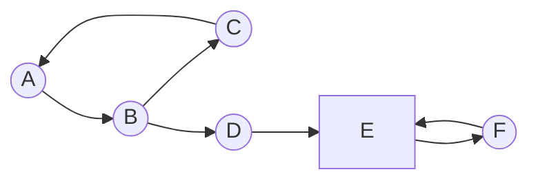
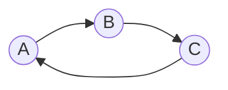
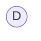
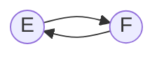
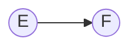
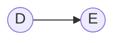
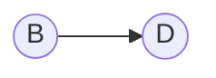

# Find Strongly Connected Components and it's bridges using Tarjans Algorithm

Versi 21 Juni 2023

## Deskripsi Tugas

Strongly Connected Components merupakan graf atau bagian dari graf berarh yang setiap node dapat dicapai dari node satu ke node lainnya. Sedangkan bridges merupakan hubungan antara 2 node yang apabila diambil/dibuang, akan mengakibatkan jaringan tersebut tidak terhubung.

Praktikal dari Strongly Connected Component dapat digunakan pada situs _social networking_ untuk menggambarkan kumpulan orang yang berteman atau memiliki kesamaan minat. Sedangkan bridges memiliki kemanfaatan untuk melihat jaringan atau hubungan yang dianggap kritikal.

Pada tugas ini, kalian diminta untuk membuat sebuah program yang mengaplikasikan algoritma Tarjans untuk mencari SCC dari sebuah graf berarah dan bridges dari graf berarah tersebut. Khusus pencarian bridges, diasumsikan graf adalah undirected graf.

## Spesifikasi Wajib (1500 Poin)

### Spesifikasi Program (Poin)

1. Program bisa menerima bentuk graf yang contoh inputnya adalah sebagai berikut berasal dari file atau bisa diketik pada terminal:

```
A B
B C
C A
B D
D E
E F
F E
```

Hasil dari masukan di atas akan berbentuk seperti ini



Output dari masukan tersebut untuk SCC adalah







Output dari masukan graph untuk mendapatkan bridges adalah







Simbol dibebaskan kepada mahasiswa

2. Bahasa pemograman menggunakan golang
3. Diperbolehkan menggunakan library untuk pengolahan adjacency matriks, tetapi tidak dibolehkan pada implementasi algoritma Tarjan.
4. Program CLI menampilkan runtime program, semua graf scc beserta bridge-nya (dibebaskan gambarannya, tetapi tetap divisualisasikan)
5. Pastikan penelusuran menggunakan DFS.

## Spesifikasi Bonus (750)

1. Implementasikan dalam bentuk Web dengan ketentuan yang sama dengan spesifikasi wajib (input dapat berupa file txt atau text box). Framework untuk frontend dibebaskan, tetapi untuk backend menggunakan Golang.

2. Menampilkan hasil Output berupa graf SCC yang didapat berdasarkan warna vertex atau graf yang berbeda, begitu juga pada bridges, dan runtime program (web tidak perlu dideploy)

### Spesifikasi Teknis (250 poin)

Tulis sebuah README dalam repository mahasiswa yang berisikan:

1. Cara penggunaan program/web
2. Penjelasan singkat mengenai algoritma tarjans yang minimal terdiri dari:
   - Kompleksitas dari algoritma Tarjan
   - Modifikasi yang dilakukan pada Tarjan Algoritma untuk mendeteksi Strong bridges
   - Penjelasan jenis edges yang ada pada graf (back edge, close edge)
3. Referensi, framework (jika mengerjakan bonus), dan library yang digunakan serta manfaatnya

## Pengerjaan dan Pengumpulan

1. Buatlah repository pada github masing-masing dan invite `yoshibeside` dalam repository tersebut
2. Jika ada pertanyaan silahkan LINE ke `angelica_winasta`
3. Pengumpulan dilakukan lewat web dengan link Tag/Release github
4. Untuk demo, silakan kontak langsung lewat line
