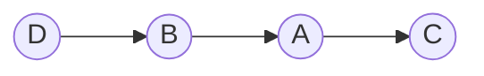

# Find Strongly Connected Components and it's bridges using Tarjans Algorithm

Versi 21 Juni 2023

## Deskripsi Tugas

Strongly Connected Components merupakan graf atau bagian dari graf berarh yang setiap node dapat dicapai dari node satu ke node lainnya. Sedangkan bridges merupakan hubungan antara 2 node yang apabila diambil/dibuang, akan mengakibatkan jaringan tersebut tidak terhubung.

Pada tugas ini, kalian diminta untuk membuat sebuah program yang mangaplikasikan algoritma Tarjans untuk mencari SCC dari sebuah graf berarah dan strong bridges dari graf berarah tersebut.

## Spesifikasi Wajib (2500 Poin)

### Spesifikasi Program (2000 Poin)

1. Program bisa menerima bentuk graf yang contoh inputnya adalah sebagai berikut berasal dari file atau bisa diketik pada terminal:

```
A C
B A
D B
```

Hasil dari masukan di atas akan berberntuk seperti ini



Simbol dibebaskan kepada mahasiswa

2. Bahasa pemograman menggunakan golang.

3. Diperbolehkan menggunakan library untuk pengolahan adjacency matriks, tetapi tidak diperboleh pada implementasi tarjans algorithm.

4. Program menampilkan runtime program, semua graf scc beserta bridge-nya.

5. Pastikan penelusuran menggunakan DFS dan algoritma dari Tarjan boleh dimodifikasi.

### Spesifikasi Teknis (500 poin)

Tulis sebuah README dalam repository mahasiswa yang berisikan:

1. Cara penggunaan program
2. Penjelasan singkat mengenai algoritma tarjans yang minimal terdiri dari:
   - Kompleksitas dari algoritma Tarjan
   - Modifikasi yang dilakukan pada Tarjan Algoritma untuk mendeteksi Strong bridges
   - Penjelasan jenis edges yang ada pada graf (back edge, close edge)
3. Referensi, framework, dan library yang digunakan serta manfaatnya

## Pengerjaan dan Pengumpulan

1. Buatlah repository pada girhub masing-maisng dan invite `yoshbeside` dalam repository tersebut
2. Jika ada pertanyaan silahkan LINE ke `angelica_winasta`
